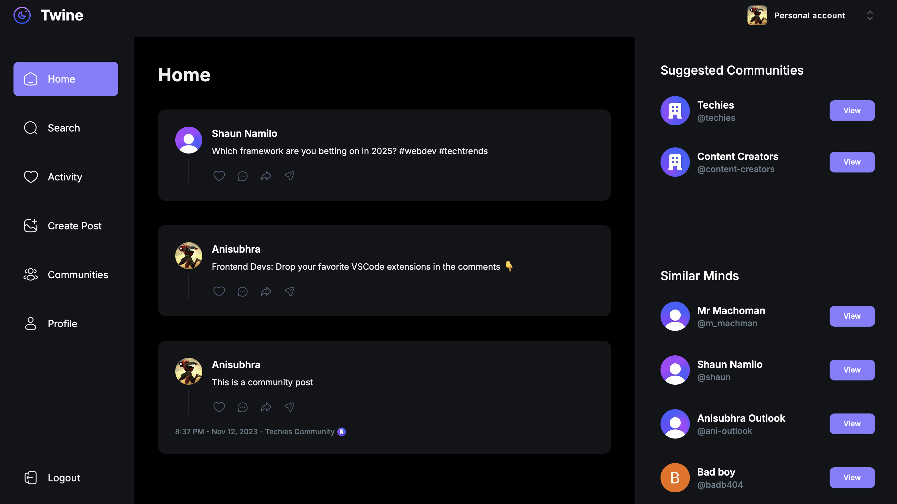

# Twine 🧵

**Twine** is a full-stack microblogging app that allows users to share short posts, reply in threads, and engage in real-time conversations. Built with modern web technologies, Twine offers a sleek and responsive user experience with features like user profiles, activity feed, community discussions, and more.

## 🔥 Preview

## 🚀 Features

- 🧵 Create and reply to posts (threaded conversations)
- 🔍 Search posts and users
- 🧑‍🤝‍🧑 Join and explore communities
- 🧾 View user profiles and activity
- 🧭 Clean, responsive UI with dark mode support
- 🔐 Authentication and authorization
- 📱 Fully responsive across devices

## 🛠 Tech Stack

- **Framework:** [Next.js](https://nextjs.org/)
- **Language:** [TypeScript](https://www.typescriptlang.org/)
- **Styling:** [Tailwind CSS](https://tailwindcss.com/)
- **Database:** [MongoDB](https://www.mongodb.com/)
- **ORM:** [Mongoose](https://mongoosejs.com/)
- **Authentication:** [Clerk](https://clerk.com/)
- **Deployment:** [Vercel](https://vercel.com/)

## 📸 Demo

🔗 [Live Demo](https://social-app-eta-seven.vercel.app/)

